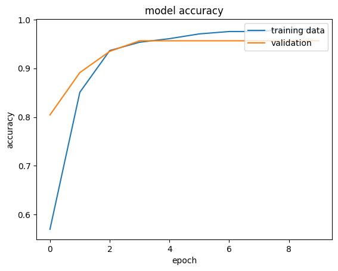
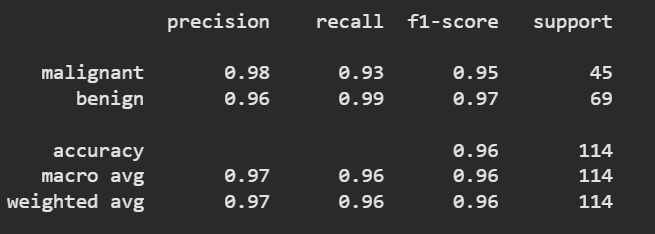

# 🧠 Breast Cancer Classification using Neural Networks

This project focuses on building a Breast Cancer Classification system using a custom Artificial Neural Network (ANN) developed with TensorFlow and Keras.

Unlike traditional Machine Learning models, this project introduces Deep Learning concepts by training a neural network to classify tumors as either Malignant or Benign based on medical diagnostic features.

---

# 📌 Project Overview

Breast cancer is one of the most common cancers worldwide, and early detection plays a crucial role in improving treatment outcomes.

In this project, a Neural Network was developed to analyze diagnostic features and predict whether a tumor is:

* Malignant (Cancerous)
* Benign (Non-Cancerous)

The goal was to understand the fundamentals of Deep Learning and gain hands-on experience building neural networks using TensorFlow and Keras.

---

# 🧠 Concepts Used

* Deep Learning
* Artificial Neural Networks (ANN)
* Binary Classification
* Data Preprocessing
* Feature Scaling
* Model Training & Evaluation
* TensorFlow
* Keras

---

# 🛠 Tech Stack

* Python
* NumPy
* Pandas
* TensorFlow
* Keras
* Scikit-Learn
* Matplotlib

---

# 🔄 Workflow

1. Load Breast Cancer Dataset
2. Data Preprocessing
3. Feature Scaling
4. Build Neural Network Architecture
5. Train ANN Model
6. Evaluate Performance
7. Predict Tumor Classification

---

# 🤖 Neural Network Architecture

A custom Artificial Neural Network was built using TensorFlow and Keras.

The model consists of:

* Input Layer
* Hidden Dense Layers
* ReLU Activation Functions
* Output Layer with Sigmoid Activation

This project focuses on understanding how neural networks learn patterns from data through forward propagation and optimization.

---

# 📈 Results

### Overall Accuracy

✅ **96.49% Accuracy**

### Classification Report

| Class     | Precision | Recall | F1-Score |
| --------- | --------- | ------ | -------- |
| Malignant | 0.98      | 0.93   | 0.95     |
| Benign    | 0.96      | 0.99   | 0.97     |

### Overall Metrics

* Accuracy: **96%**
* Macro F1 Score: **0.96**
* Weighted F1 Score: **0.96**

The model demonstrated strong classification performance and effectively distinguished between malignant and benign tumors.

.png>) .png>)  

---

# 🌍 Real-World Applications

* Healthcare AI
* Cancer Detection Systems
* Medical Decision Support
* Clinical Screening Tools
* Diagnostic Assistance Systems

---

# 📌 Key Learnings

Through this project, I learned:

* Fundamentals of Artificial Neural Networks
* TensorFlow and Keras Workflow
* Deep Learning Model Training
* Binary Classification using ANN
* Evaluation of Neural Network Models
* Healthcare AI Applications

---

# 📂 Project Structure

```text
DL-1-Breast-Cancer-Classification/
├── Project_1_5_Breast_Cancer_Classification_with_Neural_Network.ipynb
├── README.md
```

---

## 👨‍💻 Author

Aniket Khandare

GitHub: https://github.com/Aniket-k-13

LinkedIn: https://linkedin.com/in/aniket-khandare-18b822329/

---

⭐ If you found this project useful, consider giving it a star.
