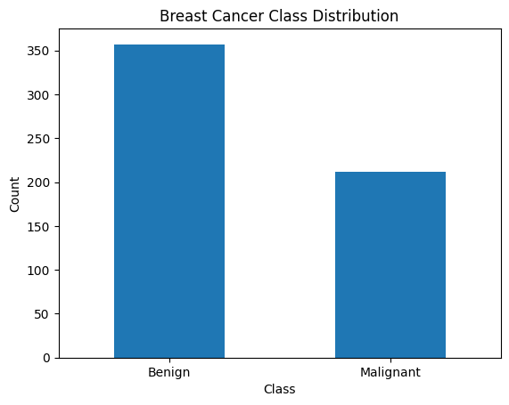

# 🩺 Breast Cancer Classification using Machine Learning

This project focuses on building a Machine Learning model capable of classifying breast cancer tumors as malignant or benign based on diagnostic measurements.

Early and accurate detection of breast cancer is critical in healthcare, and Machine Learning can assist medical professionals by providing fast and reliable predictions.

---

# 📌 Project Overview

Breast cancer is one of the most common cancers worldwide. Detecting whether a tumor is malignant (cancerous) or benign (non-cancerous) can significantly improve treatment outcomes.

In this project, a classification model was developed using diagnostic tumor data to predict the nature of breast tumors.

---

# 📊 Dataset Information

Dataset: Breast Cancer Dataset

Target Classes:

* Malignant (Cancerous)
* Benign (Non-Cancerous)

Features include:

* Radius
* Texture
* Perimeter
* Area
* Smoothness
* Compactness
* Concavity
* Symmetry
* Fractal Dimension

and several other diagnostic measurements.

---

# 🧠 Concepts Used

* Classification
* Supervised Learning
* Data Preprocessing
* Feature Analysis
* Model Training
* Model Evaluation

---

# 🛠 Tech Stack

* Python
* NumPy
* Pandas
* Matplotlib
* Seaborn
* Scikit-Learn

---

# 🔄 Workflow

1. Load Dataset
2. Data Exploration
3. Data Preprocessing
4. Train-Test Split
5. Model Training
6. Model Evaluation
7. Breast Cancer Prediction

---

# 📈 Results

### Model Performance

✅ Training Accuracy: **98.90%**

✅ Testing Accuracy: **97.37%**

.png>) .png>)  

### Observation

The model achieved high accuracy on both training and testing datasets, indicating strong predictive performance and good generalization.

---

# 🌍 Real-World Applications

* Medical Diagnosis Support
* Cancer Screening Systems
* Healthcare Decision Support
* Clinical Risk Assessment

---

# 📌 Key Learnings

Through this project, I learned:

* Building Healthcare AI Models
* Classification Techniques
* Data Preprocessing
* Model Evaluation
* Medical Data Analysis
* Machine Learning Applications in Healthcare

---

# 📂 Project Structure

```text
ML-19-Breast-Cancer-Classification/
├── Project_19_24_Breast_Cancer_Classification.ipynb
├── README.md
```

---

## 👨‍💻 Author

Aniket Khandare

GitHub Repository:
https://github.com/Aniket-k-13/Machine-Learning-Project-Series

---

⭐ If you found this project useful, consider giving it a star.
